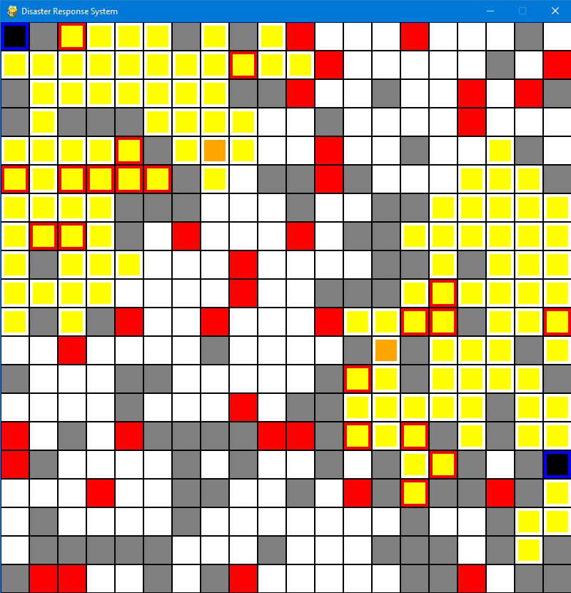
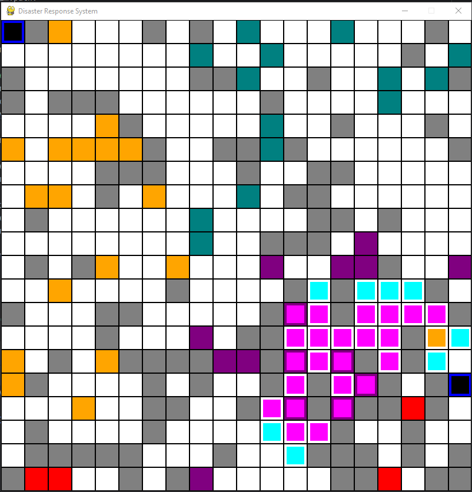
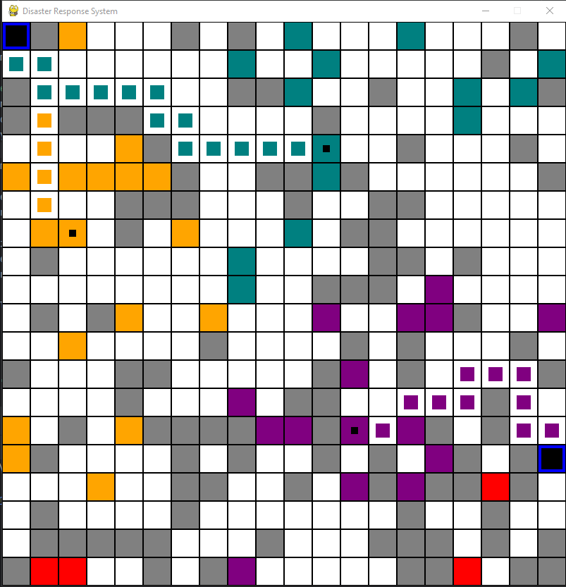

<header>
        <h1 align="center">Disaster Response System</h1>
        
Disaster response system is a project that optimizes rescue operations using pathfinding algorithms (A*, BFS) and K-means clustering for victim grouping.

</header>

        <h2>Table of Contents</h2>
        <ul>
            <li><a href="#overview">Overview</a></li>
            <li><a href="#features">Features</a></li>
            <li><a href="#installation">Installation</a></li>
            <li><a href="#usage">Usage</a></li>
            <li><a href="#project-structure">Project Structure</a></li>
            <li><a href="#results">Results</a></li>
            <li><a href="#limitations">Limitations</a></li>
            <li><a href="#future-work">Future Work</a></li>
            <li><a href="#contributors">Contributors</a></li>
            <li><a href="#license">License</a></li>
        </ul>
    

<section id="overview">
        <h2>Overview</h2>
        
This project simulates a disaster response scenario where rescue agents navigate through a grid-based environment to reach victims. The system integrates:

        <ul>
            <li><strong>Pathfinding algorithms</strong> (A* and BFS) for optimal route planning</li>
            <li><strong>K-means clustering</strong> to group victims by proximity</li>
            <li><strong>Pygame visualization</strong> for real-time simulation</li>
        </ul>
        
Developed as part of the Artificial Intelligence Lab course at Green University of Bangladesh.

</section>

<section id="features">
        <h2>Features</h2>
         <ul>
            <li>
<b>Dynamic Environment:</b> Grid-based environment with random obstacles and terrain
</li>
            <li>
<b>Agent Placement:</b> Random placement of rescue agents and victims
</li>
            <li>
<b>Victim Clustering:</b> K-means algorithm for efficient victim grouping
</li>
            <li>
<b>Pathfinding:</b> Use BFS to find victims and A* algorithms for optimal path calculation
</li>
            <li>
<b>Visualization:</b> Real-time Pygame visualization of rescue operations
</li>
        </ul>
</section>

<section id="installation">
        <h2>Installation</h2>
        
1. Clone the repository:

        

            git clone https://github.com/codesWithRifat/Disaster_Response_System.git 
            cd disaster-response-system
        
 
        
2. Install required dependencies:

        

           <ul>     
           <li>NumPy</li> 
           <li>scikit-learn</li>
            <li>Pygame </li>
           </ul>       
        

  </section>

  <section id="usage">
        <h2>Usage</h2>
        
Run the main simulation:

        

            python main.py
        

    </section>

   <section id="project-structure">
        <h2>Project Structure</h2>
        

            disaster-response-system/ 
            ├── main.py                
            ├── grid.py                 
            ├── bfs.py             
            │── astar.py                
            ├── kmeans.py         
            └── README.md             
        

    </section>

  <section id="results">
        <h2>Results</h2>
        

           <h3>BFS algorithm finding victims</h3>
            
          <h3>A* algorithm finding shortest path</h3>
            
          <h3>Kmeans algorithm finding priority zone</h3>
            
        

        
<strong>Key findings:</strong>

        <ul>
            <li>K-means effectively grouped victims for efficient rescue allocation</li>
            <li>System demonstrated reduced simulated rescue times</li>
        </ul>
    </section>

  <section id="limitations">
        <h2>Limitations</h2>
        <ul>
            <li>Static grid environment</li>
            <li>Basic agent intelligence</li>
            <li>Cluster accuracy depends on initial parameters</li>
            <li>Limited real-time feedback</li>
        </ul>
    </section>

  <section id="future-work">
        <h2>Future Work</h2>
        <ul>
            <li>Dynamic environment with moving obstacles</li>
            <li>Reinforcement learning for adaptive agents</li>
            <li>Enhanced visualization and GUI controls</li>
        </ul>
    </section>

  <section id="contributors">
        <h2>Contributors</h2>
        

            

                <h3>Mostakem Mia</h3>
                
ID: 221002015

                
<a href="https://github.com/Mostakem-mia">GitHub Profile</a>

            

            

                <h3>Ridwanur Rahman Rifat</h3>
                
ID: 221002037

                
<a href="https://github.com/codesWithRifat">GitHub Profile</a>

            

        

        
<strong>Course Teacher:</strong> Md. Sabbir Hosen Mamun

    </section>

  <section id="license">
        <h2>License</h2>
        
This project is licensed under the MIT License - see the <a href="LICENSE">LICENSE</a> file for details.

  </section>
